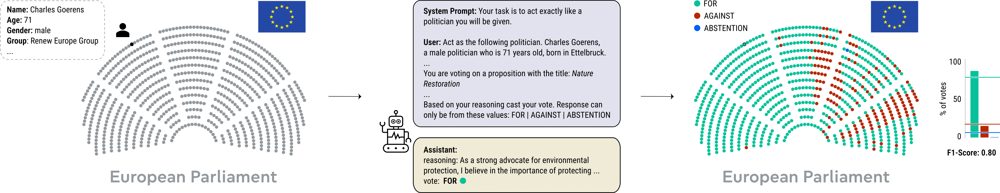

# european_parliament_simulation
Repository for Paper "Persona-driven Simulation of Voting Behavior in the European Parliament with Large Language Models"



Install Requirements: ```pip install -r requirements.txt```

``` usage: main.py [-h] [--model MODEL] [--output OUTPUT] [--reasoning REASONING] [--wiki | --no-wiki]
               [--default_personas | --no-default_personas] [--roll_call | --no-roll_call]
               [--counter_speeches | --no-counter_speeches] [--only_task | --no-only_task]
               [--attribute_list [ATTRIBUTE_LIST ...]] [--vote_list [VOTE_LIST ...]] [--temperature TEMPERATURE]
               [--opposition | --no-opposition] [--modified_speeches | --no-modified_speeches]

options:
  -h, --help            show this help message and exit
  --model MODEL         The model that will be used for inference.
  --output OUTPUT       The output path.
  --reasoning REASONING
                        The type of reasoning that should be used.
  --wiki, --no-wiki     If true, the wikipedia prompts will be used. (default: False)
  --default_personas, --no-default_personas
                        If true, the default personas will be used instead. (default: False)
  --roll_call, --no-roll_call
                        If true, the llm will be instructed that the vote is public. (default: False)
  --counter_speeches, --no-counter_speeches
                        If true, the counterfactual speeches will be given to the LLM. (default: False)
  --only_task, --no-only_task
                        If true, no persona will be given as task. (default: False)
  --attribute_list [ATTRIBUTE_LIST ...]
                        Attributes that will be used in conjunction. Possible values are: ['gender', 'age',
                        'birthplace', 'group', 'national_party', 'country']
  --vote_list [VOTE_LIST ...]
                        If a list is given, the vote will be restricted to these votes.
  --temperature TEMPERATURE
                        Temperature_hyperparameter of the LLM
  --opposition, --no-opposition
                        If true, politicians of the opposition will be told to consider ABSTENTIONS. (default: False)
  --modified_speeches, --no-modified_speeches
                        If true, the regex filtered speeches will be used. (default: True)```


Thanks to HowTheyVote (howtheyvote.eu) for providing roll call vote data.
